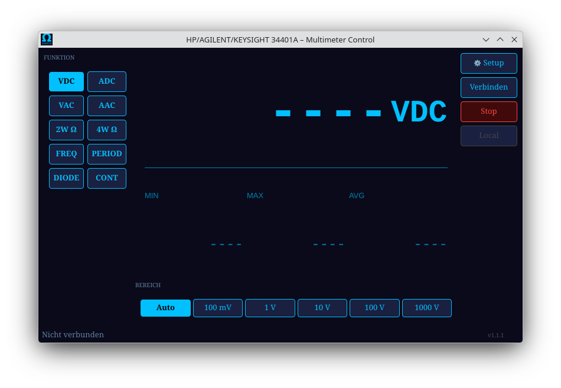

# HP / Agilent / Keysight 34401A – Linux GUI

Linux control software for the HP/Agilent/Keysight 34401A digital multimeter.  
Supports all 10 measurement modes with live display, MIN/MAX/AVG statistics and configurable settings.

Written in **C++17 / Qt6**.



---

## Features

- **10 measurement modes:** VDC, ADC, VAC, AAC, 2W Ω, 4W Ω, Frequency, Period, Diode, Continuity
- **Live display** with large readout and SI prefix scaling (m, k, M, …)
- **MIN / MAX / AVG** statistics
- **Configurable sampling rate** (50 ms / 200 ms / 500 ms)
- **NPLC** (integration time) and **Auto-Zero** settings
- **OBS streaming overlay** – frameless, always-on-top window with chroma-key green background; font, color and size configurable
- **Language switch** (Deutsch / English / Svenska) – live, no restart needed
- **Adjustable decimal places** (2 / 4 / 6)
- Settings are saved across sessions

---

## Hardware Requirements

- HP / Agilent / Keysight **34401A** multimeter
- **USB-to-Serial adapter** (e.g. CH340, FTDI, CP2102)
- **Null-modem cable or adapter** (crossed RX/TX lines – required!)
- Multimeter set to: Interface → **RS-232**, **SCPI mode** (not HP mode), **9600 baud**

> **Note:** A straight RS-232 cable will not work. You need a null-modem cable or a null-modem adapter between a straight cable and the multimeter.

---

## Installation

### Option 1 – AppImage (any Linux distro, no install needed)

Download `HP_34401A_GUI-1.1.1-x86_64.AppImage` from the [releases page](https://git.cls.net/kalle/Agilent_34401a_GUI/releases).

```bash
chmod +x HP_34401A_GUI-1.1.1-x86_64.AppImage
./HP_34401A_GUI-1.1.1-x86_64.AppImage
```

No dependencies – Qt6 and everything else is bundled.

---

### Option 2 – Arch Linux / CachyOS (.pkg.tar.zst)

Download `hp34401a-gui-1.1.1-1-x86_64.pkg.tar.zst` from the releases page.

```bash
sudo pacman -U hp34401a-gui-1.1.1-1-x86_64.pkg.tar.zst
hp34401a
```

---

### Option 3 – Ubuntu / Debian (.deb)

Download `hp34401a-gui_1.1.1_amd64.deb` from the releases page.

```bash
sudo dpkg -i hp34401a-gui_1.1.1_amd64.deb
hp34401a
```

After installation the app also appears in your application menu under **Science → HP 34401A Multimeter**.

---

### Option 4 – Build from source

Requirements: CMake 3.22+, Ninja, Qt6 (Widgets + SerialPort)

```bash
# Arch / CachyOS
sudo pacman -S cmake ninja qt6-base qt6-serialport

# Ubuntu / Debian (24.04+)
sudo apt install cmake ninja-build qt6-base-dev libqt6serialport6-dev

git clone https://github.com/SA7LAV/34401a.git
cd Agilent_34401a_GUI
cmake -B build -DCMAKE_BUILD_TYPE=Release -G Ninja
ninja -C build
./build/hp34401a
```

---

## Serial Port Permissions

On most Linux systems your user must be in the `dialout` (Ubuntu/Debian) or `uucp` (Arch/CachyOS) group to access serial ports:

```bash
# Ubuntu / Debian
sudo usermod -aG dialout $USER

# Arch / CachyOS
sudo usermod -aG uucp $USER
```

Log out and back in for the change to take effect.

---

## First Launch

1. Connect the USB-to-Serial adapter and null-modem cable to the multimeter
2. Power on the multimeter
3. On the multimeter: press **SHIFT → MENU** → Interface → RS-232, Baud → 9600, Parity → None, SCPI
4. Start the app: `hp34401a`
5. Click **⚙ Setup** → **Interface** tab → select the correct port (usually `/dev/ttyUSB0`)
6. Click **Connect** – the status bar shows *Connected: /dev/ttyUSB0 @ 9600*
7. Measurements appear live in the display

---

## Usage

### Measurement modes

Click any button in the **FUNCTION** panel on the left to switch modes.  
The **RANGE** buttons update automatically for the selected mode.  
**Auto** selects the optimal range automatically.

### MIN / MAX / AVG

Statistics are calculated from the moment you connect. Click a different **FUNCTION** to reset them.

### OBS Overlay

Enable the overlay in **⚙ Setup → Overlay**. A frameless, always-on-top window appears with a chroma-key green background – ready to key out in OBS. The window is draggable. Font family, color and size are configurable.

### Setup dialog (⚙ Setup)

| Tab | Settings |
|-----|----------|
| **Language / Sprache** | Switch between Deutsch, English and Svenska (live preview) |
| **Interface / Schnittstelle** | Port, baud rate, parity, stop bits, data bits, timeout |
| **Measurement / Messung** | Sampling rate, NPLC (integration time), Auto-Zero |
| **Display / Anzeige** | Decimal places (2 / 4 / 6), show/hide MIN/MAX/AVG |
| **Overlay** | Enable/disable, font, color, size |

Settings are saved to `~/.config/hp34401a/serial_config.ini`.

### Buttons

| Button | Function |
|--------|----------|
| **⚙ Setup** | Open settings dialog |
| **Connect / Verbinden** | Open connection dialog and connect; click again to disconnect |
| **Stop** | Pause measurements (keeps connection) |
| **Local** | Release the multimeter from remote control (SYST:LOC) |

---

## Multimeter Setup (RS-232)

The multimeter must be configured for RS-232/SCPI mode before connecting:

1. Press **SHIFT** + **MENU** on the front panel
2. Navigate to: **I/O** → **INTERFACE** → **RS-232**
3. Set **BAUD** to **9600**
4. Set **PARITY** to **NONE**
5. Set **LANGUAGE** to **SCPI** (not HP)
6. Press **ENTER** to confirm

Default serial settings used by this app: 9600 baud, 8N1 (8 data bits, no parity, 1 stop bit).  
These match the multimeter factory defaults.

---

## Building Packages

To build all package formats from source on Arch/CachyOS:

```bash
# Install build dependencies (one-time)
sudo pacman -S cmake ninja qt6-base qt6-serialport dpkg
yay -S appimagetool-bin linuxdeploy-bin linuxdeploy-plugin-qt-bin

# Build all formats (AppImage, .deb, .pkg.tar.zst)
bash packaging/build-all.sh
```

**Output files:**

| File | Format | Platform |
|------|--------|----------|
| `dist/HP_34401A_GUI-1.1.1-x86_64.AppImage` | AppImage | Any Linux x86_64 |
| `dist/hp34401a-gui_1.1.1_amd64.deb` | .deb | Ubuntu / Debian |
| `packaging/hp34401a-gui-1.1.1-1-x86_64.pkg.tar.zst` | pacman | Arch / CachyOS |

---

## Troubleshooting

**No serial port visible in the Setup dialog:**  
→ Check USB-to-Serial adapter is connected: `ls /dev/ttyUSB*`  
→ Check group membership: `groups $USER`

**Connection error / timeout:**  
→ Verify null-modem cable (not a straight cable)  
→ Verify multimeter is in SCPI mode (not HP mode)  
→ Try increasing Timeout in Setup → Interface

**Reading shows +9.90000E+37:**  
→ Multimeter is in overload. The app ignores these values automatically.

**App opens but display stays at `----`:**  
→ Click **Connect**, select port and confirm.

---

## License

MIT – see source repository for details.

## Author

Kalle Hagen – [kalle@sa7lav.se](mailto:kalle@sa7lav.se)  
Repository: [github.com/SA7LAV/34401a](https://github.com/SA7LAV/34401a)
